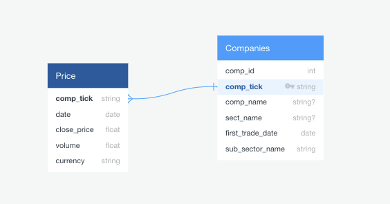

# Project ETL (Extract, Transform, Load)

This repository presents and ETL project that is hosted in a live server and is accessible [here](https://etl-sp500.herokuapp.com/).

### Data Sources:
* [Wikipedia List of S&P 500 companies](https://en.wikipedia.org/wiki/List_of_S%26P_500_companies)
* [Yahoo finance](https://pypi.org/project/yahoo-finance/)

### Group Members:
* Jocelyn Flores
* Gabriel Pivaro
* Kimberly Flores

What useful investigation could be done with the final database?
The Wikipedia gives us a list of the Company names, sector and tickers. We can use this to go and get more information on the Yahoo finance side to get the stock prices to analyze how the sector is performing during a set time frame.

Whether final database will be relational or non-relational. Why?
We will be using a relational database because our information is very structured and additionally we have access to a cloud MySQL so that we can all access the database.

### Project Description:

We chose Wikipedia for the web scraping of the list of the S&P 500 companies and Yahoo finance for the stock closing prices. We chose Wikipedia because of the information that was provided alongside the list of the companies. We chose Yahoo Finance because it was a free API with data going back to the 1960s and had a surplus of the data that we needed in case we wanted to expand the project.

The S&P 500 list of companies was scraped from Wikipedia using Pandas/Python since the data was available in a table format on Wikipedia. The table contained the company's ticker name, Sector, Sub Sector and the date that company first started trading. Using the list of the the S&P 500 companies, a new dataframe was created using the company ticker as the index. While all the financial data pulled using a wrapper that would access the Yahoo API to get the company’s trade information per date. A loop was used to pull the financial data from the Yahoo Finance API into the dataframe containing the list of companies. 

Data clean up included removal and renaming of colunmns from the table scrapped from Wikipedia to fit the table that existed in the SQL database. Null values existing in the "First Trade Date" column were configured in database to accept those values. However, two dates existing in the "First Trade Date" column existed as well. These rows were located and the dates were separated. The first date was used since it was the date the latest date and the date that was related to the price information. Because of the massive amount of data available and the timeframe for the return was also very long, therefore we limited the timeframe to January 2010 through October 23, 2020 (when the data was pulled from Yahoo Finance). All of this data was loaded into a SQL database. 

We used a SQL database because our data was structured and due to us having access to a cloud SQL server. This made data easier to view by the group. The ERD is included below along with the Schema.



```
CREATE TABLE companies (
    id INT SERIAL DEFAULT VALUE,
    comp_tick VARCHAR(5) PRIMARY KEY,
    comp_name VARCHAR(50) Not Null,
    sect_name VARCHAR(50) Not Null,
    sub_sect_name VARCHAR(55),
    first_trade_date DATE
);
```


```
CREATE TABLE price (
    id SERIAL PRIMARY KEY,
    comp_tick VARCHAR(5) REFERENCES companies(comp_tick),
    date DATE,
    close_price FLOAT,
    volume FLOAT,
    currency VARCHAR(3)
);
```


This database can be used to track the performance of companies over time and see how they are progressing against other companies in the same sector. The data can be scraped and then used for further analysis and visualizations. You can group data by sector or sub-sector and see their statistical summary and recognize patterns. You can organize the companies by the sector or sub-sector as well in the case that you are only interested in a particular sector/sub-sector.
